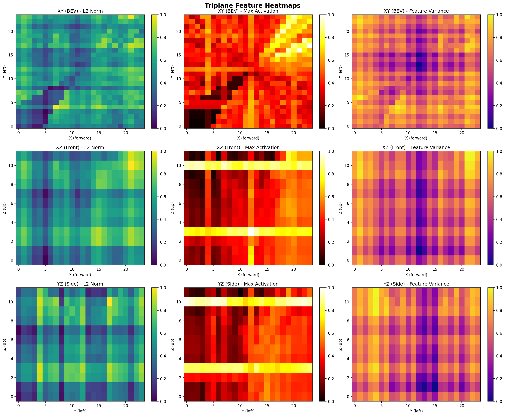
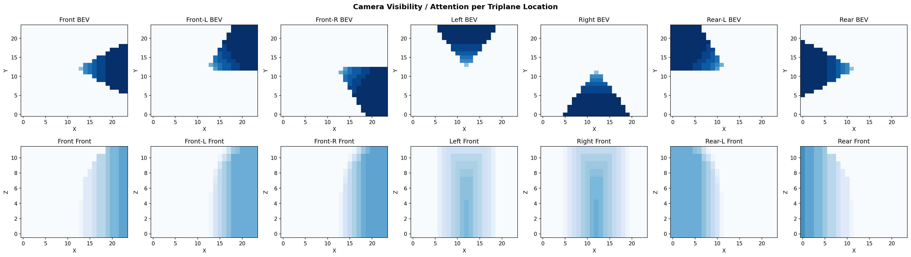
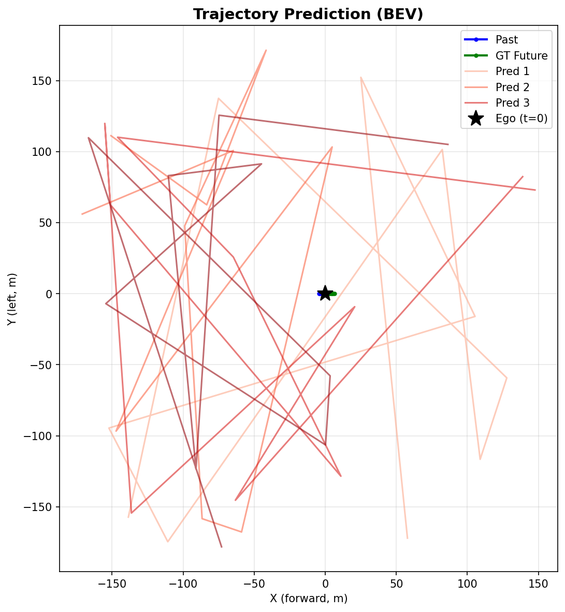

# Efficient Multi-Camera Tokenization with Triplanes for End-to-End Driving

An implementation of triplane-based multi-camera tokenization for end-to-end autonomous driving. The model lifts surround-view camera images into a compact triplane 3D representation, patchifies them into tokens, and autoregressively predicts future ego trajectories.

## Architecture

```
Multi-Camera Images (B, C, 3, H, W)
        │
        ▼
┌─────────────────────┐
│   Image Encoder     │  DINOv2-ViTS/14 (frozen) or lightweight ConvNet
│   (per-camera)      │
└────────┬────────────┘
         │  (B, C, Hf, Wf, Df)
         ▼
┌─────────────────────┐
│   3D Lifting via    │  Deformable cross-attention with learned
│   Deformable Attn   │  sampling offsets across cameras
└────────┬────────────┘
         │  Three orthogonal planes: XY, XZ, YZ
         ▼
┌─────────────────────┐
│   Triplane          │  XY (BEV): (Sx, Sy, Df)
│   Representation    │  XZ (Front): (Sx, Sz, Df)
│                     │  YZ (Side): (Sy, Sz, Df)
└────────┬────────────┘
         │  Patchified into tokens
         ▼
┌─────────────────────┐
│   AR Transformer    │  Causal attention over [sensor | past_traj | future_traj]
│   (8 layers)        │  Sensor tokens: bidirectional, Trajectory: causal
└────────┬────────────┘
         │
         ▼
┌─────────────────────┐
│   Trajectory Head   │  Discretized (x, y) prediction via vocabulary
│   + Vol. Rendering  │  Optional NeRF-style reconstruction loss
└─────────────────────┘
```

## Key Components

| Module | Description |
|--------|-------------|
| **ImageEncoder** | DINOv2-ViTS/14 backbone (384-dim) projected to feature dim |
| **LiftingModule** | 4-layer deformable cross-attention lifting 2D features to 3D grid |
| **TriplaneRepresentation** | Three orthogonal feature planes with bilinear 3D querying |
| **TriplanePatchifier** | Spatial patching (4x6x6) with MLP projection to transformer dim |
| **ARTransformer** | 8-layer causal transformer (512-dim, 8 heads) for trajectory generation |
| **TrajectoryHead** | Linear decoder producing discretized (x, y) coordinate logits |
| **VolumetricRenderer** | NeRF-style volume rendering for self-supervised geometry learning |

## Visualizations

### Triplane Feature Heatmaps
L2 norm, max activation, and feature variance across XY (BEV), XZ (front), and YZ (side) planes:



### Camera Visibility per Triplane Location
Which cameras contribute to each 3D location (BEV and front views per camera):



### Image Encoder Features
DINOv2/ConvNet feature maps overlaid on input camera images:


### Trajectory Prediction
Past trajectory (blue), ground truth future (green), and sampled predictions (red):



## Setup

```bash
pip install -r requirements.txt
```

**Requirements:** PyTorch >= 2.0, torchvision, einops, timm, tqdm, numpy

## Usage

### Training with dummy data

```bash
# Quick smoke test (small config)
python -m triplane_drive.train --epochs 2 --batch_size 2 --small --no_render

# Full config
python -m triplane_drive.train --epochs 10 --batch_size 2 --device cuda
```

### Training with NuScenes

Download [NuScenes mini](https://www.nuscenes.org/nuscenes#download) and place it under `data/nuscenes/`:

```
data/nuscenes/
├── samples/
├── sweeps/
├── v1.0-mini/
├── maps/
└── LICENSE
```

```bash
python -m triplane_drive.train --epochs 1 --batch_size 1 --small --no_render --nuscenes data/nuscenes
```

### Evaluation

```bash
python -m triplane_drive.evaluate --model_path triplane_model.pt --num_samples 20 --device cuda
```

Computes **minADE6** at 1s, 3s, and 5s horizons.

### Visualization

```bash
python -m triplane_drive.visualize --output_dir visualizations --device cpu
```

Generates 6 heatmap images: triplane features, encoder features, camera visibility, token norms, volumetric rendering comparison, and trajectory predictions.

## Configuration

Key parameters in `triplane_drive/config.py`:

| Parameter | Default | Description |
|-----------|---------|-------------|
| `num_cameras` | 7 (6 for NuScenes) | Number of surround-view cameras |
| `image_height/width` | 320 x 512 | Input image resolution |
| `sx, sy, sz` | 96, 96, 48 | Triplane spatial grid dimensions |
| `range_xy` | 180m | Spatial coverage in XY plane |
| `d_ar` | 512 | Transformer hidden dimension |
| `ar_num_layers` | 8 | Transformer depth |
| `future_steps` | 50 | Prediction horizon (5s at 10Hz) |
| `traj_vocab_size` | 1000 | Discretization bins for trajectory |

## Project Structure

```
triplane_drive/
├── config.py                 # TriplaneConfig dataclass
├── model.py                  # TriplaneDriveModel (end-to-end)
├── train.py                  # Training loop
├── evaluate.py               # minADE evaluation
├── visualize.py              # Heatmap visualizations
├── dummy_data.py             # Synthetic dataset for testing
├── nuscenes_data.py          # NuScenes dataset loader
├── losses.py                 # Combined reconstruction + trajectory loss
├── modules/
│   ├── image_encoder.py      # DINOv2 / ConvNet backbone
│   ├── lifting.py            # Deformable cross-attention 2D→3D
│   ├── triplane.py           # Triplane storage and 3D querying
│   ├── patchify.py           # Triplane → tokens
│   ├── ar_transformer.py     # Causal transformer
│   ├── trajectory_head.py    # Trajectory logit decoder
│   └── volumetric_renderer.py # NeRF-style volume rendering
└── utils/
    ├── geometry.py            # Camera projection, grid creation
    └── positional_encoding.py # Sinusoidal 3D encodings
```
